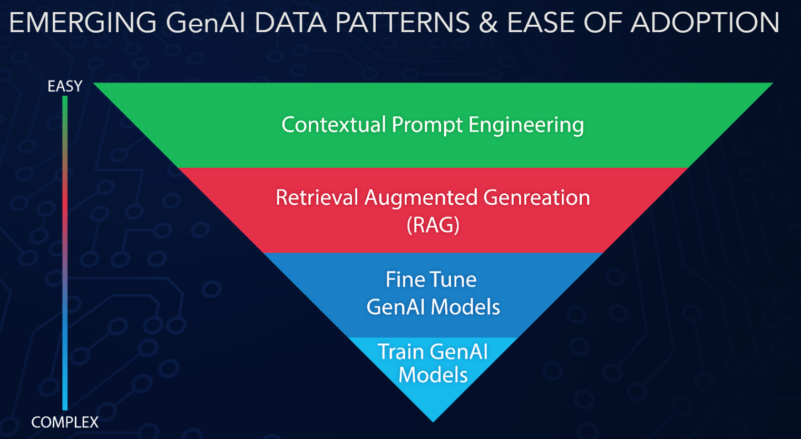
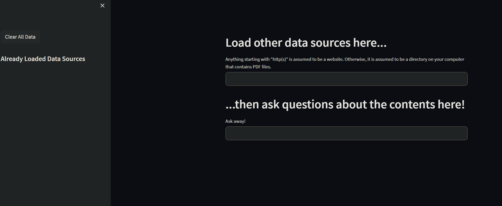
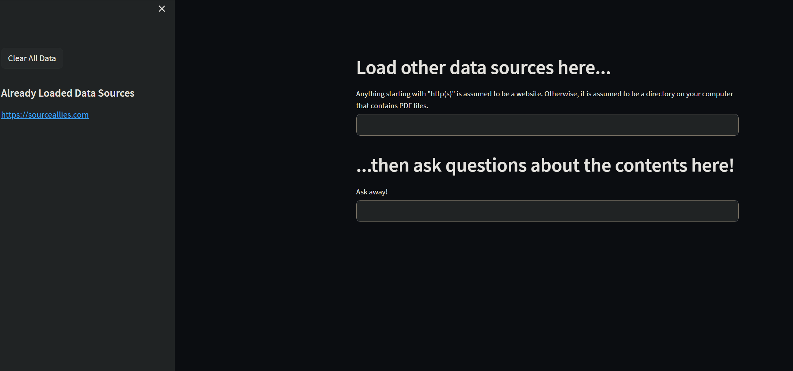

# RAG Chat

This is meant to be a small POC that showcases being able to embed website and pdf info ad hoc into a locally running Postgres vector store, then feed that data into an LLM chain.

Rag stands for "Retrieval Augmented Generation", and usually involves taking data sources, using AI to generate embeddings that represent the content, then retrieving any relevant content to feed into a large language model before you ask a question.

This app is meant to showcase how RAG solutions are great for adding data and context "at runtime".  Fine tuning a model is great if you want to change it's behavior, but if you just want to leverage data mixed with plain langauge, RAG is a much cheaper, and easier, solution.

## How to Use

You will need a few things for this.

- Python
- Poetry
- Docker
- An OpenAI API Key

To start:

- Create a `.env` file with contents `OPENAI_API_KEY=YOUR_API_KEY_HERE`, replacing YOUR_API_KEY_HERE with your API key.
- Run `poetry install` to install your dependencies if you have not already.
- Run `docker compose up -d` to start our containerized postgres DB.
  - Make sure this starts up properly. You can start it without the flag in a different terminal instead if you wish.
- Run `poetry run streamlit run src/app.py`
  - This should start the app locally pointed to your containerized postgresd vector store, and open your broswer to the hosted web UI.

## The App

From the UI you will be able to dynamically add and remove data sources to your embedded vector store by simply prioviding a url, or a local path to a directory that contains PDFs. 

After adding any data sources you wish, ask a question.  This is often referred to as 
"Chatting with you data sources."  You should be able to pull information out of the website of PDF information using natural language that relates to the content of the source.

## So How Does It Work?

For a rag solution to work you need a few pieces:
- Sources of data.
  - In this case, this is provided by the user at runtime, but is often a collection of data, like an already populated wiki, or DB dataset.
- A model to generate embeddings.
  - In this case, we are using the OpenAI embedding API.  This can fairly easily be swtiched over to using a local model, since the processing is not as intensive as text or image generation like other models.
- A place to store your embeddings
    - Usually called a vector store.
    - This is also used in concert with the embedding model to do similarity searches when you ask a question and return related embedded content.
    - In this case, we are using Postgres with the pgvector extension turned on.  This is nice becasue we can store the data "at rest", meaning starting and restarting both the app and the docker container will still persist the data you have already embedded.
- A large langauge model (LLM) to accept your question and your relevant embedded information as context.
  - In this case we are using the OpenAi chat API, however, you can point to any large language model you want, including private models running locally, or on the cloud.
- A UI
    - Optional, this could all really be done from the command line.
    - In this case we are using the Streamlit library to create a lightweight ui.

For this project, we are using Langchain to orchestrate all these pieces together.  It also helps by providing easy ways to parse urls and pdfs for text content.

There are more robust ways to consume data from these sources, like crawling for related weblinks, or converting the raw HTML to markdown and preserving images, but this is for a lightweight POC, feel free to enhance!